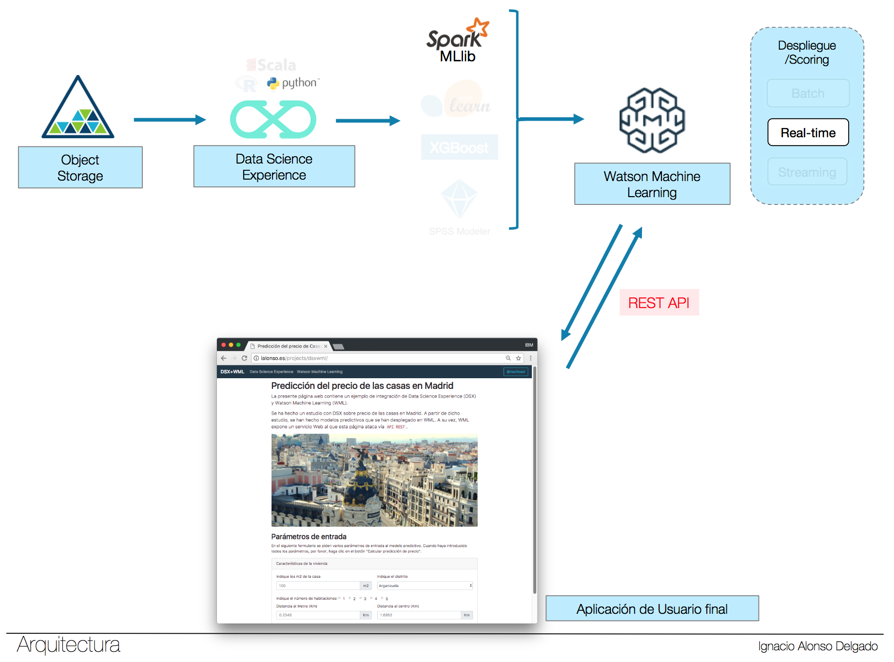

# Data Science Experience + Watson Machine Learning

## Índice

1. [URL](https://github.com/nachoad/dsx-wml#url)
2. [Descripción](https://github.com/nachoad/dsx-wml#descripci%C3%B3n)
3. [Archivos](https://github.com/nachoad/dsx-wml#archivos)
4. [Arquitectura](https://github.com/nachoad/dsx-wml#arquitectura)

## URL

Puedes ver la aplicación funcionando en esta dirección:
http://ialonso.es/projects/dsxwml/

## Descripción

Este proyecto muestra una demo de página web que llama al Endpoint de Watson Machine Learning, pasándole unos parámetros y obteniendo un resultado al ejecutar un modelo predictivo.

## Archivos

Básicamente la web sólo necesita dos archivos: <code>index.php</code> y <code>result.php</code>

<code>index.php</code>: Envía las creenciales de autenticación a Watson Machine Learning y recoge el token. Muestra la página principal de la aplicación con un formulario que contiene los parámetros de entrada del modelo. Este formulario envía tanto el token como el resto de parámetros a result.php

<code>result.php</code>: recibe los parámetros de index.php, y los envía al Endpoint de Watson Machine Learning para obtener el resultado final que muestra por pantalla. En este caso el precio de la vivienda.

## Arquitectura

Arquitectura de la demo:

